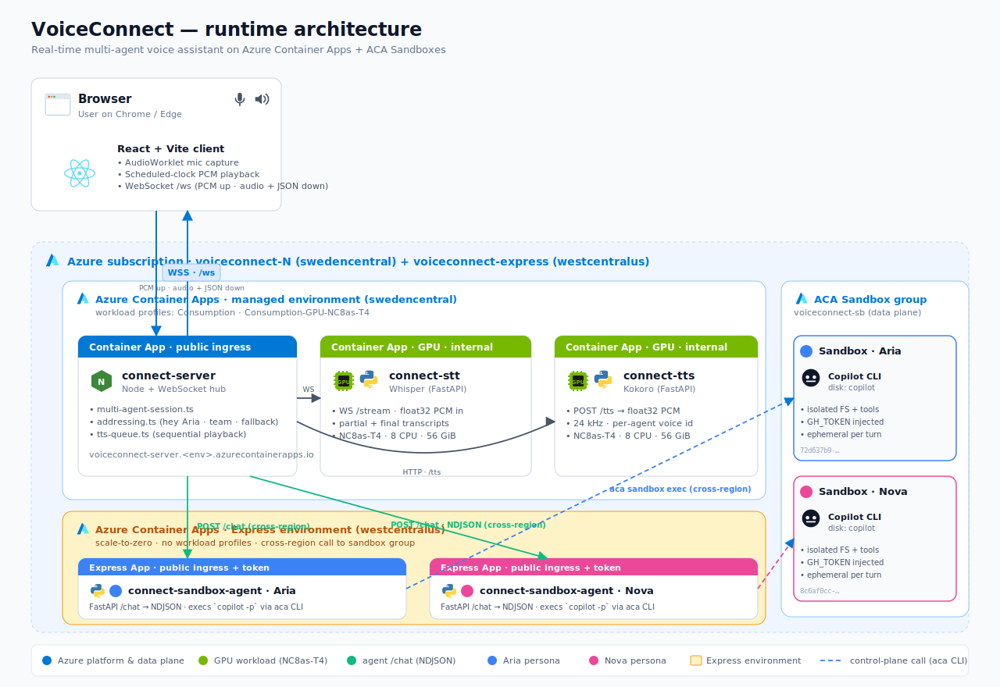

# VoiceConnect

Real-time multi-agent voice assistant. The browser captures mic audio, streams it
through a Node server to a GPU-backed STT service, then dispatches the transcript
to one or more **sandbox agents** (each running GitHub Copilot CLI inside a
dedicated Azure Container Apps **Sandbox**). Replies are streamed back through a
GPU TTS service and played in the browser.



Two voices today (Aria and Nova); the design scales to 4. Each persona has its
own colour, voice, system prompt, and isolated sandbox so tool calls never
collide.

## Repository layout

```
client/                 React + Vite browser UI
server/                 Node WS hub, addressing, TTS queue
services/
  stt/                  Whisper-based STT (FastAPI, GPU)
  tts/                  Kokoro TTS (FastAPI, GPU, float32 PCM @ 24 kHz)
  agents/sandbox/       Generic agent that proxies /chat → sandbox `copilot` CLI
infra/
  main.bicep            All Azure resources (env, GPU CAs, server, agent CAs)
  agent.bicep           Per-agent Container App module
  acr-role.bicep        AcrPull role assignment for the user-assigned MI
  deploy-phase2.ps1     One-shot end-to-end deploy
Dockerfile              connect-server image (builds client and bundles dist/)
docker-compose.yml      Local dev (without sandboxes)
```

## Architecture highlights

- **Sandbox-per-agent.** Each persona gets a dedicated ACA Sandbox provisioned
  via `aca sandbox create --disk copilot`. The agent Container App holds the
  sandbox id in env and proxies HTTP `/chat` calls to `aca sandbox exec -c
  "copilot -p \"$P\" --allow-all-tools --output-format json"`.
- **Streaming reply parsing.** The agent reads the Copilot CLI JSONL output and
  emits an NDJSON `{type:"text",content}` event when it sees an
  `assistant.message`. `assistant.message_delta` events are ignored to avoid
  double emission.
- **Addressing.** `server/src/addressing.ts` decides whether a turn is targeted
  at one agent ("hey Aria, …"), broadcast to all ("team, …"), or routed to a
  fallback agent. Mode (`addressed`, `addressed-with-fallback`, or `round-robin`)
  is exposed in the UI.
- **TTS queue.** `server/src/tts-queue.ts` serialises audio output across agents
  so they don't talk over each other. It frames each turn with
  `agent_speaking_start { sample_rate, sequence }` JSON, then forwards binary
  PCM frames verbatim, then `agent_speaking_end`.
- **Scheduled-clock playback.** `client/src/hooks/useAudio.ts` schedules each
  PCM chunk on the `AudioContext` clock (`source.start(nextStartTime)` with
  `nextStartTime = max(currentTime, prevTail)`). It also linearly upsamples to
  the device rate in JS so the browser doesn't independently resample tiny
  buffers and add fade-in/out artifacts at every chunk boundary.
- **Mic.** `AudioWorklet` captures float32 PCM and posts ArrayBuffers up the WS.

## Deploy to Azure

Prereqs:

- `az` logged in to a subscription with sandbox-group support enabled.
- `aca` CLI on PATH (typically at `~/.aca/bin`). See
  [aca-cli docs](https://github.com/microsoft/azure-container-apps/tree/main/docs/early/aca-cli).
- `gh` CLI logged in (we source `gh auth token` for Copilot CLI inside sandboxes).
- An ACR you can push to. The default is `simon.azurecr.io`.

One command:

```powershell
cd infra
.\deploy-phase2.ps1
# optional flags:
#   -ResourceGroup voiceconnect-3      # re-deploy onto an existing RG
#   -SkipImageBuild                   # reuse current images
#   -SkipSandboxProvisioning          # reuse existing sandboxes
```

The script:

1. Creates the next `voiceconnect-N` resource group (or uses `-ResourceGroup`).
2. Builds & pushes `connect-server` and `connect-sandbox-agent` images via ACR
   tasks. (STT and TTS images are expected to already be in the registry; their
   Dockerfiles are under `services/stt` and `services/tts` if you need to
   rebuild them.)
3. Creates an ACA Sandbox group and one sandbox per agent.
4. Runs `infra/main.bicep` to deploy the env, two GPU services, the server, and
   one Container App per agent.
5. Grants the user-assigned MI the *Container Apps SandboxGroup Data Owner*
   role on the sandbox group, then restarts agents so they pick it up.
6. Registers each agent with the server's `/api/agents` endpoint.
7. Prints `https://<server>?token=dev-token` to open in Chrome.

## Local dev

`docker-compose up` brings up STT, TTS, server, and the Vite client. Sandbox
agents need real Azure to run, so for local dev point the server at remote
agent FQDNs (the server has env-driven registration, but currently we register
via the deploy script — see *Known limitations* below).

## Operational notes

- **Voices.** Kokoro voices are configured per-agent (`af_sky` for Aria,
  `am_adam` for Nova). Available voices live in `services/tts/`.
- **Authentication.** Single shared `AUTH_TOKEN` (default `dev-token`). The
  client passes it as `?token=…`. Replace before exposing.
- **Server registry.** `server/connect-store.json` is currently written into
  the container's writable layer, so a server image redeploy wipes registered
  agents. The deploy script always re-registers, but if you `az containerapp
  update --image` manually you must re-`POST /api/agents`.
- **Image refresh.** `az containerapp update --image foo:latest` doesn't force
  a re-pull when the tag is unchanged. Use `az acr import` to materialise a new
  tag, then update with that tag.
- **Logs.** `az containerapp logs show --format text` may hit a `'charmap'
  codec` crash on Windows pwsh. Workaround: `--format json | Out-File -Encoding
  utf8`.

## Debugging audio

Append `?debug=1` to the URL to enable a per-turn audio capture panel that
exposes `<audio controls>` plus a download link for each agent reply. The
captured WAV is byte-identical to what was streamed over the wire — useful when
diagnosing playback vs. transport issues.

## Known limitations / TODO

- Server registry isn't persistent. Either mount a volume on
  `connect-store.json` or move to env-driven registration via Bicep.
- No interrupt-during-speech UX yet (the protocol supports it; UI is minimal).
- Round-robin and broadcast modes work but haven't been tuned for long
  multi-turn conversations.
- Only Aria and Nova ship today; adding Pip / Vox / etc. is just another entry
  in the `agents` array of `deploy-phase2.ps1` and `main.bicep`.
